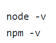
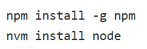
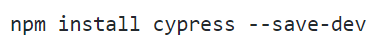
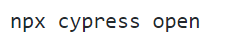

# Testes automatizados com Cypress - QualityMap Challenge

👋 Seja bem-vinda(o)!

É muito bom tê-la(o) aqui. Neste desafio vou lhe apresentar cenários de testes automatizados com cypress. ❤️

## O que vamos automatizar?

Durante o desafio de testes automatizados com Cypress vamos desenvolver scripts para as seguintes funcionalidades:

- Criação de um registro com sucesso
- Validar mensagem de erro durante o registro
- Login com sucesso
- Fazer uma reserva em um hotel

## Guia de instalação

✅ Tenha instalado em sua máquina a IDE [VsCode](https://code.visualstudio.com/download).

✅ Tenha instalado em sua máquina o Nodejs [Nodejs](https://nodejs.org/en/download).

📌 Certifique-se das versões instaladas

📌 Com seu promp de comando execute os seguintes comandos no repositório do projeto:

📌 Instalação do gerenciador de pacotes Node 

📌 Instalação do cypress

📌 Depois de instalado, você pode tentar abrir o Cypress novamente com o comando:

## Onde será disponibilizado essa automação de testes?

Automação disponível no repositório do GitHub [**quality-map-challenge**](https://github.com/luannoleto/quality-map-challenge).

## O teste será executado em uma pipeline de testes?

Sim!!! 🤪
A automação de testes realizada aqui neste desafio terá o Continuos Integration (CI) do próprio github Actions rodando nossos testes.